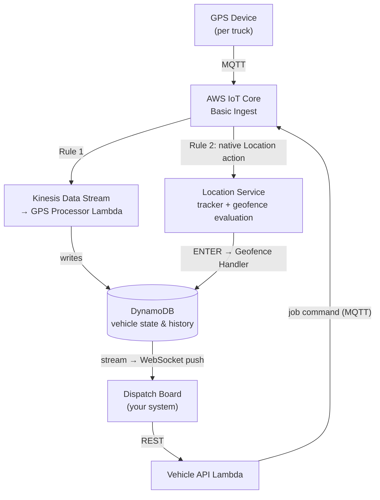

# Fleet Tracking Platform — Implementation Guide

A real-time GPS fleet tracking backend built on AWS serverless services, designed for small to medium fleets (20–200 vehicles). This repository contains the complete infrastructure-as-code, Lambda handlers, vehicle simulator, and demo dashboard.

---

## Prerequisites

Before you begin, make sure you have the following installed and configured:

| Requirement | Notes |
|-------------|-------|
| **AWS account** | With permissions to deploy IoT Core, Kinesis, DynamoDB, Lambda, Location Service, Cognito, API Gateway, CloudFront, S3, WAF, CloudWatch, SNS, and Secrets Manager. |
| **AWS CLI v2** | Configured with credentials for target AWS account |
| **Node.js 20.19+ or 22.12+** | Includes `npm`. Enforced by the `engines` field in `package.json`. Node 22.x matches the `nodejs22.x` Lambda runtime the stacks deploy. |
| **AWS CDK** | Invoked via `npx cdk` (CDK CLI is a dev dependency of `infra/`). The account/region must be bootstrapped once  |
| **jq** | Used by the provisioning and cleanup scripts. |
| **curl** | Used to detect your public IP for WAF allowlisting. |

> **Note:** This is a deployed AWS application, not a local-only app. Running it provisions real AWS resources that incur cost. Tear everything down with the [Cleanup](#cleanup) steps when you're done.

---

## Quick start

```bash
# 1. Install dependencies
npm install
cd infra && npm install && cd ..
cd src && npm install && cd ..
cd dashboard && npm install && cd ..

# 2. Set your deployment region (defaults to us-east-1)
export AWS_REGION="${AWS_REGION:-us-east-1}"

# 3. Bootstrap CDK (first time only)
ACCOUNT_ID=$(aws sts get-caller-identity --query Account --output text)
npx cdk bootstrap aws://${ACCOUNT_ID}/${AWS_REGION}

# 4. Deploy all stacks
# Gather both IPv4 and IPv6 — clients may reach CloudFront over either, and
# IPv6 addresses rotate on macOS (privacy extensions). Either may be empty.
cd infra
IPV4=$(curl -4 -s --max-time 5 ifconfig.me || true)
IPV6=$(curl -6 -s --max-time 5 ifconfig.me || true)
npx cdk deploy --all \
  --context deployerIpv4=$IPV4 \
  --context deployerIpv6=$IPV6 \
  --require-approval never
cd ..

# 5. Provision device certificates and deploy dashboard
./scripts/provision-devices.sh
./scripts/deploy-dashboard.sh

# 6. Start the simulator
./scripts/start-simulator.sh
```

> **Seeing a white page or MIME-type errors in the browser?** Your IP has likely changed since the last deploy. Run `./scripts/update-ip-allowlist.sh` to refresh the WAF allowlists for both IPv4 and IPv6, then hard-refresh the dashboard (Cmd+Shift+R).

---

## Table of contents

- [What gets deployed](#what-gets-deployed)
- [Architecture](#architecture)
- [Dispatch system integration](#dispatch-system-integration)
- [Monitoring and alerting](#monitoring-and-alerting)
- [Cost summary](#cost-summary)
- [Cleanup](#cleanup)
- [Optional extensions](#optional-extensions)
- [Documentation deep dives](#documentation-deep-dives)

---

## What gets deployed

The `cdk deploy --all` command deploys seven stacks:

| Stack | What it creates |
|-------|-----------------|
| **FleetIoTStack** | IoT Core thing group, device policy, one thing per vehicle, fleet indexing |
| **FleetIngestionStack** | Kinesis Data Stream, `fleet_gps_to_kinesis` IoT rule, DynamoDB tables (vehicle state, GPS history, dispatch, WebSocket connections), GPS Processor and active-vehicles-counter Lambdas, two SQS dead letter queues |
| **FleetPhase2TablesStack** | Multi-tenant tables, analytics aggregation, GSIs on core tables |
| **FleetLocationStack** | Amazon Location Service tracker, geofence collection, map, place index, route calculator, `fleet_gps_to_location` IoT rule, geofence handler and email processor Lambdas |
| **FleetMonitoringStack** | CloudWatch dashboard, alarms, SNS alerting topic |
| **FleetApiStack** | REST API, WebSocket API, Cognito user pool, vehicle/tenant/analytics Lambdas |
| **FleetHostingStack** | S3 bucket, CloudFront distribution, WAF rules for the demo dashboard |

### Post-deployment access

**Demo dashboard:**
```bash
aws cloudformation describe-stacks --stack-name FleetHostingStack \
  --query "Stacks[0].Outputs[?OutputKey=='CloudFrontDomain'].OutputValue" --output text
```

**Demo credentials:**
```bash
# Email: demo@fleet-tracking.local
# Password:
aws secretsmanager get-secret-value --secret-id fleet-tracking/demo-user-password \
  --query SecretString --output text | jq -r .password
```

**CloudWatch dashboard:**
```bash
aws cloudformation describe-stacks --stack-name FleetMonitoringStack \
  --query "Stacks[0].Outputs[?OutputKey=='DashboardUrl'].OutputValue" --output text
```

---

## Architecture



The GPS Processor Lambda performs two operations per message: upsert vehicle state and write position history.

Positions reach Amazon Location Service without a Lambda in the path. Devices publish to two [Basic Ingest](https://docs.aws.amazon.com/iot/latest/developerguide/iot-basic-ingest.html) topics, each handled by its own IoT rule:

| Topic | Rule | Action | Receives |
|---|---|---|---|
| `$aws/rules/fleet_gps_to_kinesis/fleet/vehicles/<id>/gps` | `fleet_gps_to_kinesis` | Kinesis → Lambda → DynamoDB | every position |
| `$aws/rules/fleet_gps_to_location/fleet/vehicles/<id>/gps` | `fleet_gps_to_location` | native [Location action](https://docs.aws.amazon.com/iot/latest/developerguide/location-rule-action.html) → tracker | all positions, or only those near a point of interest |

Two rules rather than two actions on one rule: a rule's `WHERE` clause applies to the whole rule, so a single rule cannot send every position to DynamoDB while sending only a filtered subset to Location Service. Splitting them keeps route playback complete while letting the tracker path be filtered, which matters because Location Service bills per tracker update **and** per geofence evaluation.

### Controlling Amazon Location Service cost

Location Service bills per location update **and** once per linked geofence collection evaluation, so each position counts twice. Two filters stack here, in this order:

**1. Native tracker filtering (primary, zero code).** The tracker is created with `positionFiltering: "DistanceBased"`, so Amazon Location ignores updates where the device moved less than 30 m — and ignored updates are neither stored nor evaluated, cutting both billed dimensions. This is one property on the tracker.

Choose it deliberately, because the modes are not equivalent:

| Mode | Ignored updates | Effect |
|---|---|---|
| `DistanceBased` | moved < 30 m | not stored, **not evaluated** — reduces both cost dimensions |
| `AccuracyBased` | moved < measured accuracy | not stored, not evaluated — but needs accuracy data |
| `TimeBased` (service default) | none | only thins **storage**; every update is still evaluated and billed |

`AccuracyBased` is unavailable with the native Location rule action, which has no accuracy parameter. Amazon Location treats missing accuracy as zero and applies no filtering at all.

The 30 m threshold is safe against the geofences here (home base 50 m, job sites 100 m) and has a reliability benefit too: it suppresses the repeated enter/exit events a parked vehicle can trigger when it jitters on a geofence edge.

**2. Device-side proximity filtering (optional, additive).** Set `LOCATION_PROXIMITY_FILTER=true` on the simulator to publish to the tracker topic only when a vehicle is near its assigned job destination or home base. This is additive because it avoids the request entirely — native filtering can only act after a position has been sent. The radius (`LOCATION_PROXIMITY_RADIUS_M`, default 2000) must stay comfortably larger than the geofences being evaluated, since ENTER/EXIT events are derived from position updates and over-filtering would suppress the EXIT event.

Note that distance-based savings depend on how much your fleet actually moves. At a 5-second ping, 30 m corresponds to roughly 13 mph: below that, consecutive positions fall inside the threshold and get filtered; on the highway, almost nothing is. Parked and slow-moving vehicles are where the savings come from.

> **Why Kinesis between IoT Rule and Lambda?** Batching efficiency (10 records per invocation vs. 10 separate invocations), traffic spike buffering, 24-hour replay capability, partial batch failure handling, metrics captured, and support for multiple consumers on the same stream.

### Partial batch failure handling

By default, Lambda checkpoints a Kinesis batch only on complete success — any single bad record fails the whole batch and the entire batch is retried. [Partial batch responses](https://docs.aws.amazon.com/lambda/latest/dg/services-kinesis-batchfailurereporting.html) avoid that, and they need **both** halves wired up:

1. `reportBatchItemFailures: true` on the event source mapping (`IngestionStack`)
2. A handler that returns the failed sequence numbers (`gps-processor` returns `{ batchItemFailures: [{ itemIdentifier }] }`)

Returning the payload without enabling the setting does nothing — Lambda ignores the response and still fails the whole batch.

Two behaviours worth knowing:

- **Successful records can be reprocessed.** Lambda checkpoints at the *lowest* returned sequence number and retries everything from there, so records after the earliest failure may be delivered twice. The GPS processor is safe here because both writes are keyed by `vehicleId` (+ `timestamp` for history), so a replay overwrites rather than duplicates. Keep any handler you add idempotent.
- **Bisecting interacts with it.** With `bisectBatchOnError: true` also set, the batch is bisected at the returned sequence number and only the remaining records retry.

Records still failing after `retryAttempts: 3` go to the `fleet-gps-processor-dlq` SQS queue.

---

## Dispatch system integration

The platform provides two integration patterns. For complete API reference and code examples, see the [CLI & Developer Guide](./docs/cli-developer.md).

### REST API

```bash
GET  /vehicles                    # All vehicles with current positions
GET  /vehicles/{id}               # Single vehicle detail
GET  /vehicles/{id}/history       # Historical track (24h)
POST /jobs                        # Dispatch a job
```

**Example — dispatch a job:**
```bash
POST /jobs
{
  "address": "123 Technology Dr, Huntsville, AL 35805",
  "vehicleId": "vehicle-001",
  "description": "Loading dock B, call on arrival"
}

# Response (201):
{
  "jobId": "3f2a9c14-8e7b-4d51-9f0a-2c6b8d1e4a77",
  "vehicleId": "vehicle-001",
  "address": "123 Technology Dr NW, Huntsville, AL 35805, United States",
  "coordinates": { "lat": 34.7304, "lng": -86.5861 },
  "eta": "2026-03-25T15:45:00Z",
  "distanceKm": 12.4,
  "geofenceId": "job-3f2a9c14-8e7b-4d51-9f0a-2c6b8d1e4a77"
}
```

### WebSocket (real-time push)

The WebSocket endpoint requires a Cognito ID token in the query string:

```javascript
const ws = new WebSocket(`wss://{ws-api-id}.execute-api.{region}.amazonaws.com/v1?token=${idToken}`);

ws.onmessage = (event) => {
  const update = JSON.parse(event.data);
  updateVehicleOnMap(update.data.vehicleId, update.data.position.lat, update.data.position.lng);
  updateVehicleStatus(update.data.vehicleId, update.data.status);
};
```

### Vehicle status lifecycle

The platform tracks vehicles through a status lifecycle. Both automatic transitions are driven by geofence **ENTER** events — there is no EXIT-driven transition:

```
available ──▶ en-route ──▶ returning ──▶ available
                  ▲            ▲             ▲
                  │            │             │
             job assigned  job site      home base
             (POST /jobs)  ENTER         ENTER
                           (automatic)   (automatic)
```

The dashboard renders the backend status directly (`available`, `en-route`, `returning`), falling back to `offline` when a vehicle has no status yet. Dispatchers see arrival in real time without manual check-in from drivers.

---

## Monitoring and alerting

The `FleetMonitoringStack` creates a CloudWatch dashboard (`fleet-tracking-operations`) with:
- Jobs completed (24h), active vehicles, and current alarm status
- GPS message throughput and processing latency
- Amazon Location Service tracker updates
- Kinesis stream health and consumer lag
- API Gateway response times and error rates
- Lambda invocations, duration (p50/p99), errors, and throttles
- DynamoDB capacity consumption
- WebSocket connection counts
- SNS notification delivery
- SQS dead letter queue depth

### Alarms

Six alarms are deployed, all publishing to the `fleet-ops-alerts` SNS topic:

- **Kinesis consumer lag** — iterator age > 60 seconds
- **Lambda error rate** — > 10 errors in 5 minutes
- **API Gateway 5xx errors** — > 10 in 5 minutes
- **IoT Rules DLQ** — ≥ 1 message (2 evaluation periods)
- **GPS Processor DLQ** — ≥ 1 message (2 evaluation periods)
- **Job Completion DLQ** — ≥ 1 message (2 evaluation periods)

See [CloudWatch Monitoring Guide](./docs/cloudwatch.md) for thresholds, custom metrics, and how to subscribe an email to the SNS topic.

---

## Cost summary

> All estimates based on us-east-1 pricing. Verify current rates via the [AWS Pricing Calculator](https://calculator.aws/).

**Basis:** 5-second GPS updates, 10-hour days, 22 days/month (~158K messages/vehicle/month).

| Configuration | 20 vehicles | 100 vehicles |
|---------------|-------------|--------------|
| **Demo** — as deployed: 5 s reporting, every position to Location Service | ~$235/mo ($11.76/vehicle) | ~$858/mo ($8.58/vehicle) |
| **Production** — 30 s reporting, proximity filtering | ~$27/mo ($1.37/vehicle) | ~$85/mo ($0.85/vehicle) |

Amazon Location Service is ~88% of the demo bill, because it charges per tracker write **and** again per geofence evaluation. Two settings close most of the gap, in order of impact:

| Change | How | Effect at 20 vehicles |
|---|---|---|
| Reporting interval 5 s → 30 s | `PUBLISH_INTERVAL=30000` | −78% Location Service |
| Proximity filtering | `LOCATION_PROXIMITY_FILTER=true` | −80% of remaining Location Service |

`npm run simulator:production` sets both together.

The Kinesis stream already defaults to **one provisioned shard** (~$10.95/mo) rather than
on-demand, which would bill a flat ~$29/mo regardless of volume. A shard carries 1,000
records/sec; 100 vehicles at 5 s is 20/sec. Use `--context kinesisOnDemand=true` only if your
traffic is genuinely spiky, or `--context kinesisShards=N` to add capacity.

Note that per-vehicle cost *falls* as the fleet grows: Location Service pricing is tiered, and the Kinesis shard, alarms, and once-a-minute counter Lambda are fixed regardless of fleet size. Amazon Location Service also only bills while a vehicle is **moving** — `DistanceBased` filtering discards sub-30 m jitter, so a parked vehicle costs pipeline charges and nothing at the tracker.

**Additional non-AWS costs** (not included): GPS hardware (~$60–150/unit), cellular data (~$5–15/vehicle/month), professional installation if hardwired.

> For detailed per-service breakdowns and optimization strategies, see [Other Considerations](./docs/other-considerations.md).

---
 
## Cleanup

```bash
# 1. Stop the simulator (Ctrl+C if running)

# 2. Detach IoT resources that block CDK deletion
./scripts/pre-cleanup.sh

# 3. Destroy all CDK stacks
cd infra && npx cdk destroy --all --force && cd ..

# 4. Remove orphaned resources (certificates, log groups, S3 buckets)
./scripts/post-cleanup.sh
```

> **Note:** If your IP changes and the dashboard becomes inaccessible or shows a white screen, run `./scripts/update-ip-allowlist.sh` to refresh the WAF allowlists for both protocols. `deploy-dashboard.sh` also calls this script automatically before each upload.

---

## Optional extensions

The core platform exposes the integration points (CloudWatch metrics and alarms, the `fleet-ops-alerts` SNS topic, raw GPS data in DynamoDB and Kinesis) so you can layer on additional tools without modifying the core stacks. Each option below points to AWS-supported guidance rather than custom setup steps.

| Extension | What it adds | How to set it up |
|-----------|-------------|------------------|
| **Amazon Managed Grafana** | Advanced visualization over CloudWatch metrics | Follow the [AWS getting-started guide](https://docs.aws.amazon.com/grafana/latest/userguide/getting-started-with-AMG.html) to create a workspace and add [CloudWatch as a data source](https://docs.aws.amazon.com/grafana/latest/userguide/using-amazon-cloudwatch-in-AMG.html)|
| **ServiceNow incident management** | Auto-create incidents from CloudWatch alarms | Two AWS-supported patterns: [SNS → Lambda → ServiceNow REST API](https://aws.amazon.com/blogs/mt/how-to-automatically-create-an-incident-in-servicenow-from-an-amazon-cloudwatch-alarm/) (custom Lambda) or the [AWS Service Management Connector for ServiceNow](https://aws.amazon.com/blogs/mt/create-servicenow-incidents-for-amazon-cloudwatch-alarms-using-aws-service-management-connector-for-servicenow/) |
| **AI/ML and analytics** | Predictive maintenance, route optimization, dashboards, generative AI queries | The fleet platform's data flows (DynamoDB tables, Kinesis stream, S3 archive) feed the standard AWS analytics services. See [AI/ML & Analytics](./docs/ai-ml-analytics.md) for a routing guide to the right AWS pattern based on your use case |
| **Connected Mobility on AWS** | Enterprise telemetry (CAN bus, signal catalogs, OEM data) | Switch to the full [AWS Connected Mobility Guidance](https://docs.aws.amazon.com/guidance/latest/connected-mobility-on-aws/solution-overview.html) when you need richer vehicle data than GPS alone. |

---

## Documentation deep dives

| Guide | What it covers |
|-------|----------------|
| [CLI & Developer Guide](./docs/cli-developer.md) | Full API reference, authentication, integration code examples |
| [CloudWatch Monitoring](./docs/cloudwatch.md) | Operational dashboards, alarms, metric definitions |
| [React Dashboard](./docs/react-dashboard.md) | Demo web interface for testing and validation |
| [Other Considerations](./docs/other-considerations.md) | Cost optimization, scaling strategies, alternatives |

---

## Related AWS resources

- [AWS IoT for Automotive Workshop](https://catalog.workshops.aws/awsiotforautomotive/en-US) — Hands-on automotive IoT patterns
- [Connected Mobility on AWS](https://docs.aws.amazon.com/guidance/latest/connected-mobility-on-aws/solution-overview.html) — Enterprise-scale connected vehicle guidance (recommended for 200+ vehicles)
- [Connected Mobility GitHub](https://github.com/aws-solutions-library-samples/guidance-for-connected-mobility-on-aws) — Open-source reference implementation
